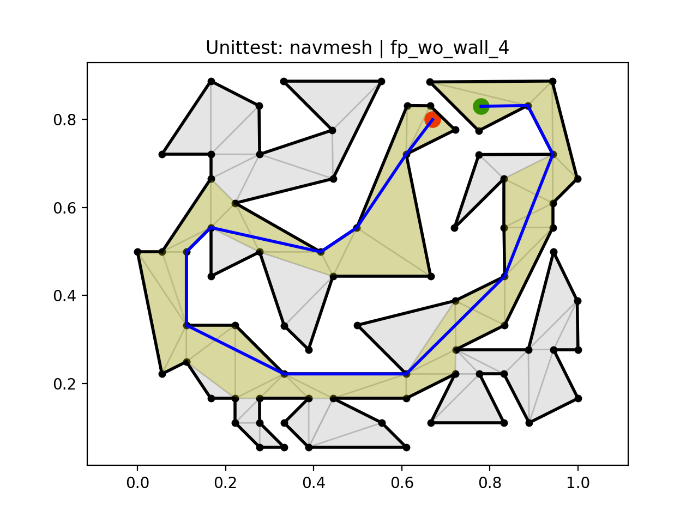
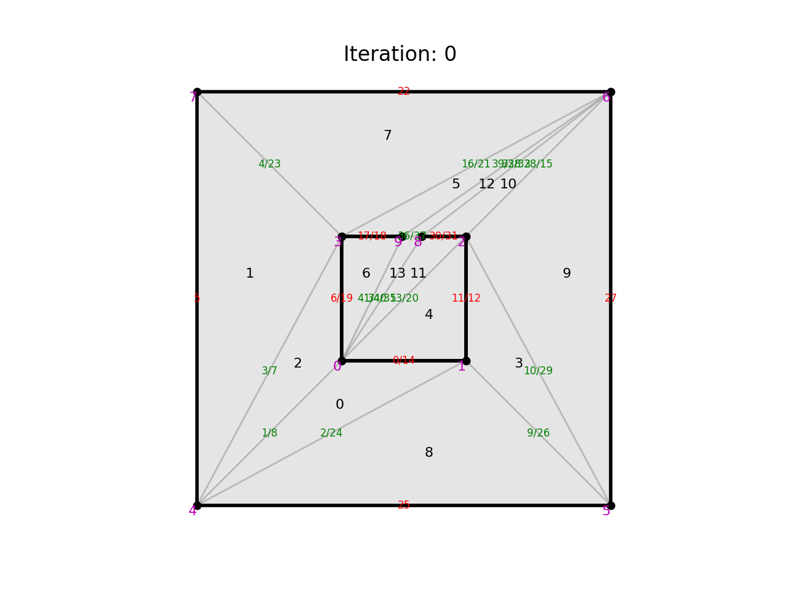
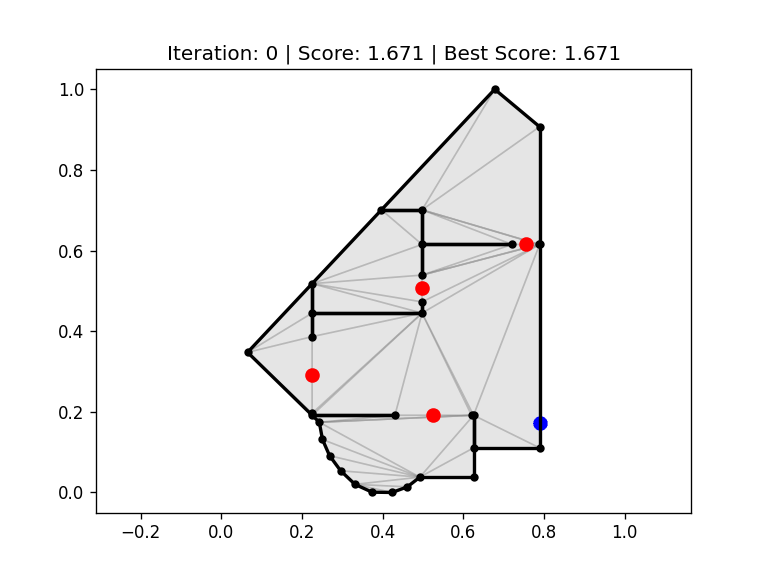

# FlowPortals: Door Placement Optimizer

## Introduction

Door placement optimization based on **human flow efficiency** for floor plan or map generation.

## Dependencies

- Python3.11 or higher
- PythonCDT : for generating constrained delaunay triangulation mesh
- Numpy
- Matplotlib

## Usage

### Clone this repo

```bash
git clone --recurse-submodules https://github.com/WvXY/FlowPortals.git
```

### PIP3

```bash
cd FlowPortals
python -m venv .venv
.venv\Scripts\activate 
# source .venv/bin/activate # Linux/MacOS
pip install numpy matplotlib
pip install -i https://test.pypi.org/simple/ PythonCDT  # recommended
# pip install PythonCDT/  # or local build and install 
```

## Structure

- `g_xxx`: Geometry
- `f_xxx`: Floor plan related
- `s_xxx`: ECS and related
- `o_xxx`: Optimization
- `u_xxx`: Utility functions
- `t_xxx`: Test/unittest
- `e_xxx`: Experiment/Execution


## Gallery
#### Navmesh - Path


#### Debug


#### Results


--------
## Other

### Progress & TODOs

- [X] Fix navmesh
- [X] Generate constraint mesh
- [X] Mesh tweaking functions
- [X] Door optimizer
- [X] Optimize and test
- [X] Refactor and improve performance

### Known Issues

- [ ] Logger is not working on windows
- [ ] When point on the edge, path cannot be found.

### Black Formater Setting

```--line-length=80 --preview```
